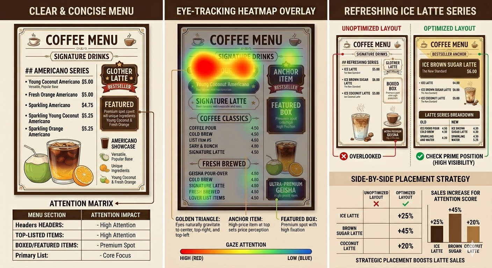

# Menu Design
## What is good menu design?
The golden rule is the 80/20 rule: Few customers will read the entire menu. 20% of the menu items generate 80% of the sales. Some customers will only look at the top of the menu, some will only look at the one or two items after each section header. So it's important to put your best items in those prime spots and make them stand out.

- Clear and concise: The menu should be easy to read and understand. It should clearly list the drink names, ingredients, and prices. Avoid using jargon or complicated language that might confuse customers.
- A consistent naming convention for our drinks helps with branding and makes it easier for customers to understand our menu.
- Visually appealing: The menu should be visually attractive and reflect the brand's identity. Use colors, fonts, and layout that align with the overall aesthetic of the café. Consider using images or illustrations to make the menu more engaging.
- Organized: The menu should be organized in a logical way, such as grouping similar drinks together (e.g., all espresso-based drinks in one section, all cold drinks in another). This helps customers navigate the menu and find what they are looking for quickly.
- Highlighting specials: If there are any special drinks or promotions, make sure they are prominently displayed on the menu. This can help drive sales and encourage customers to try new items.
- Pricing: The prices should be clearly listed and reasonable for the target market. Consider offering a range of price points to cater to different customer preferences and budgets.

## Standardized Terms
- **One shot**: One shot = 1 ounce (~30ml) of espresso. Espresso is the core of the drink.
- **Two shots**: Two shots = 2 ounces (~60ml) of espresso. This is the standard amount for most drinks. It provides a good balance of flavor and caffeine without being too strong or too weak.
- **Cup Size**: 12oz (~350ml). This is a common size for balanced flavor and portion control. 16oz will make the drink too diluted and less flavorful while 8oz is too small and too strong for most customers.
- **Ice**: 3/4 cup of ice which is needed to chill the drink and balance the flavors. Big ice cubes are preferred because they melt slower and keep the drink from getting watered down too quickly. It also looks more appealing in the cup. The best result is that when customers finish the drink, there is still some ice left in the cup. This means the drink is still cold until the last sip.
- **Modifiers**: These are the unique ingredients we add to the base drink (Americano) to create different flavors. They can be fresh juices, flavored syrups, coconut water, etc. The key is to use high-quality ingredients that complement the espresso and create a delicious and refreshing drink.
- **Sparkling water**: This is an optional ingredient that can be added to create a sparkling version of the drink. It adds a refreshing fizz and can enhance the flavors of the modifiers. When using sparkling water, it's important to add it after the modifiers and before the espresso to maintain the carbonation and create a nice layered effect in the cup.
- **Decaf**: A decaffeinated espresso option where the caffeine has been removed from the coffee beans before brewing. Decaf espresso tastes nearly identical to regular espresso but contains very little caffeine (about 97% less). It is a great option for customers who are sensitive to caffeine or want to enjoy a coffee drink later in the day without disrupting their sleep. Any drink on our menu can be made decaf by substituting the regular espresso shot with a decaf shot — no other changes to the recipe are needed.

## Processing 
>Standardized recipe is crucial for consistency. We will use a simple recipe format that includes the ingredients, measurements, and preparation steps. This will help us maintain quality and ensure that every drink tastes the same, regardless of who makes it.
- Modified Americano:
    - 3/4 cup of ice (it helps to chill the cup first before adding espresso)
    - adding modifiers to the bottom of the cup until it almost fills up (reserve ~2cm of space for espresso)
    - slowly pour 2 shots of espresso (~60ml) over the ice and modifiers. (This allows the flavors to mix gradually and creates a nice layered effect in the cup)
    - gently insert a straw. Don't stir.
    - serve 
    - Fill the rest of the cup with water (hot or cold depending on preference)

- Modified Sparkling Americano
    - 50 / 50 ratio of sparkling water and modifiers. Add sparkling water after the modifiers and before the espresso. Slowly pour sparkling water to maintain carbonation. This allows the carbonation to stay intact and creates a refreshing, fizzy drink.

## Quality Control
- We will use a simple rubric to evaluate the quality of our drinks. The rubric will include
- Flavor: balance of espresso and modifiers, overall taste
- Presentation: appearance of the drink, use of ice, layering effect
- Consistency: following the recipe, maintaining the same quality across different batches
- Customer Feedback: collecting feedback from customers to understand their preferences and improve our menu over time.
## Americano Series
- The Americano is a great base for our menu because it's simple, popular, and versatile. We can create different variations by adding unique ingredients that reflect our brand and appeal to our customers.
- **Decaf available**: Any drink in this series can be made with a decaf espresso shot upon request.
### Young Coconut Americano
- Espresso shot
- Fresh young coconut water
- Served over ice
### Fresh Orange Americano
- Espresso shot
- Freshly squeezed California orange juice
- Served over ice
### Sparkling Americano
- Espresso shot
- Sparkling water
- Served over ice with a slice of lemon
### Sparkling Young Coconut Americano
- Espresso shot
- Fresh young coconut water
- Sparkling water
- Served over ice with a slice of lime
### Sparkling Orange Americano
- Espresso shot
- Freshly squeezed California orange juice
- Sparkling water
- Served over ice with a slice of orange

## Refreshing Ice Latte Series
- **Decaf available**: Any drink in this series can be made with a decaf espresso shot upon request.
### Ice Latte
- Espresso shot
- Milk
- Served over ice

### Ice Brown Sugar Latte
- Espresso shot
- Milk
- Fresh young coconut water

### Ice Coconut Latte
- Espresso shot
- Milk
- Freshly squeezed California orange juice

## Sparkling and Water
### Sparkling Water
### Ice Water