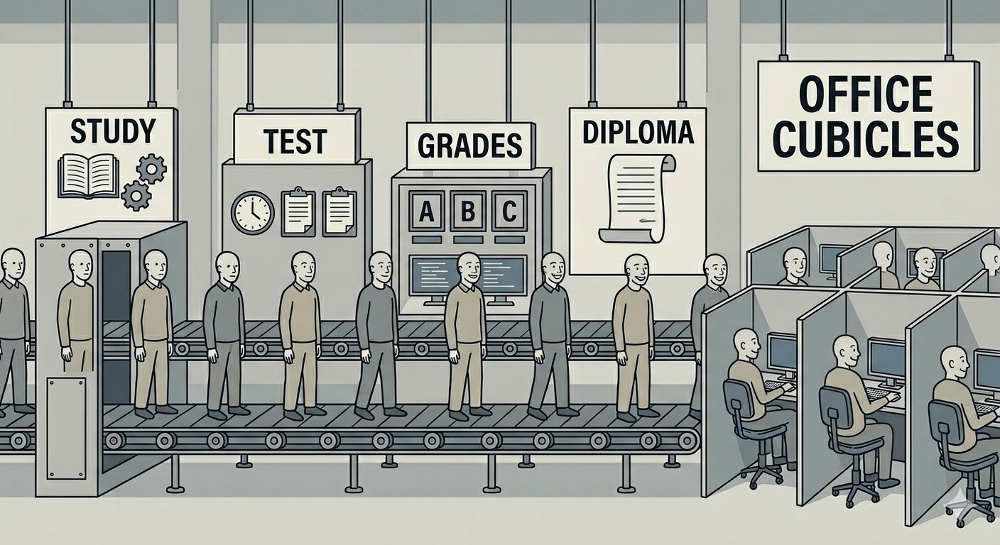
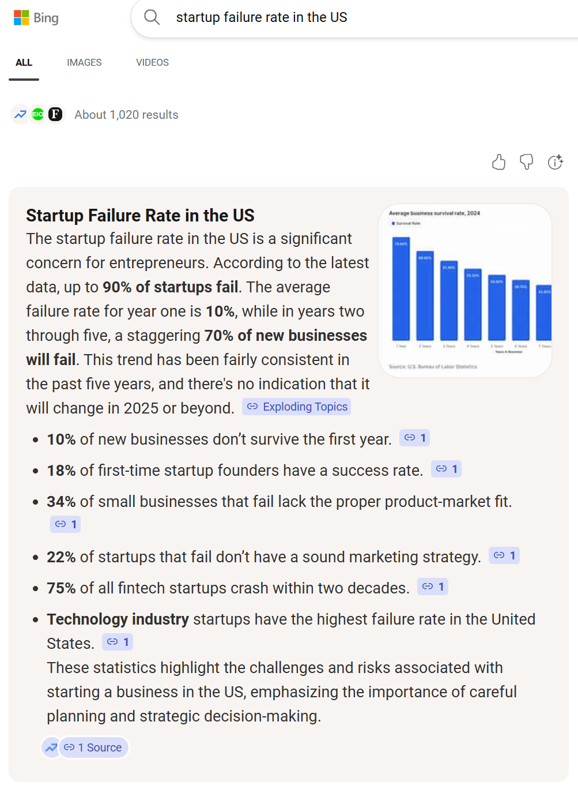
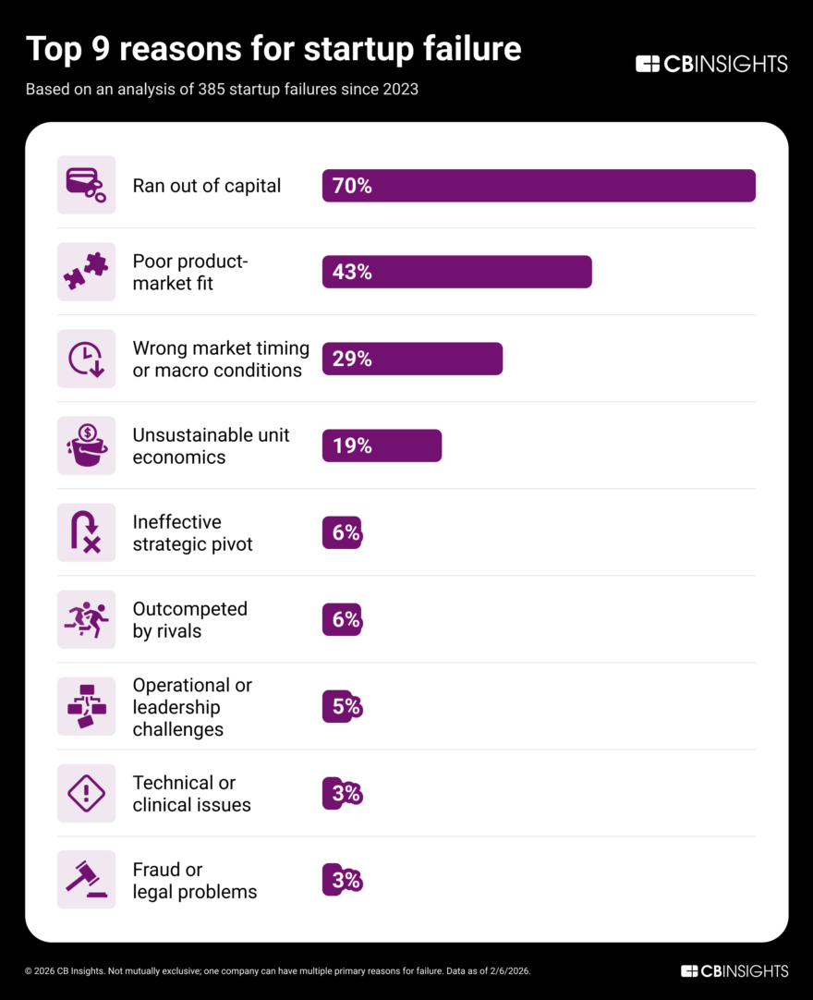
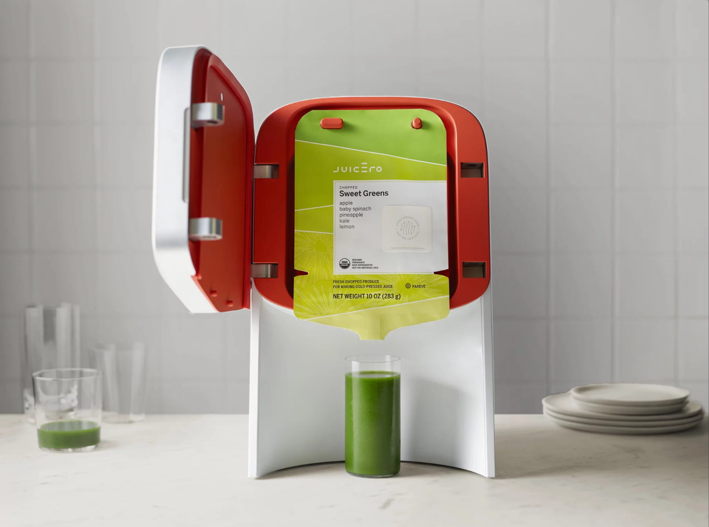
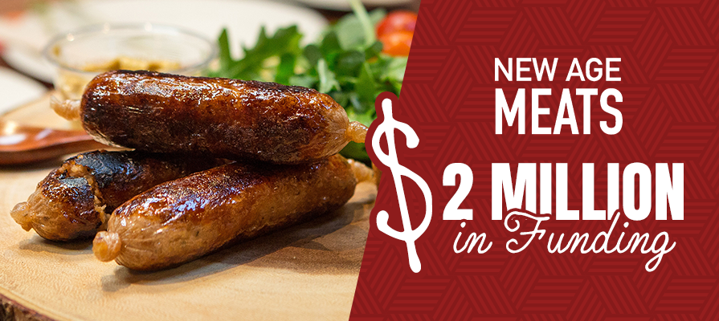
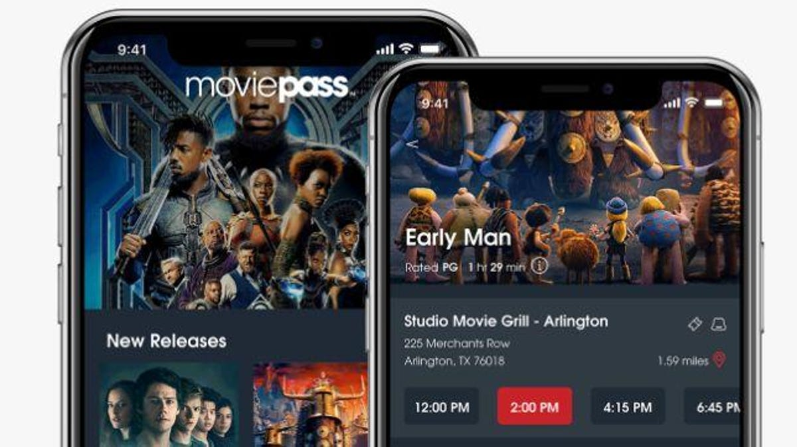
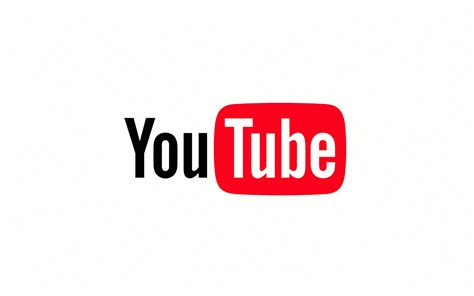
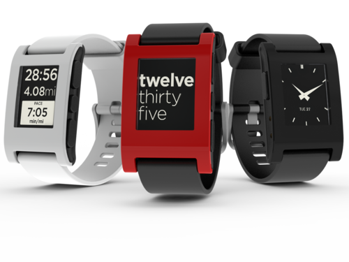
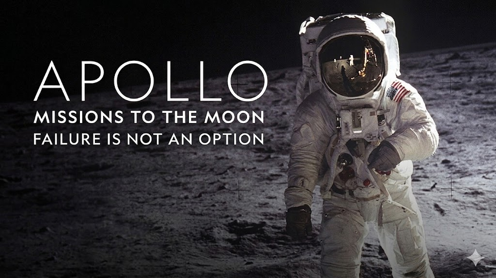

# Coffee Startup Club - Week 1: Entrepreneurship and the Coffee Industry

Welcome to the Coffee Startup Club! In this program, you will get a hands-on experience in launching and running a real business. You will be making coffee, selling coffee but more importantly, you are learning how to think like an entrepreneur.

Write down the word "**entrepreneur**" in your notebook. What does it mean to you? What do you think entrepreneurs do? (pause and let students reflect)
Maybe you have heard or never heard the word "entrepreneur" before. Maybe you have a vague idea of what it means. Well, I can tell you what entrepreneurship is. On the surface, it seems like it's about starting a business. Underneath, it's a mindset, a way of finding problems and discovering opportunities. It's about creating value for others, taking risks, learning from failure, and constantly improving. It's a doing mindset, not just a thinking mindset. We will explore these together as we build our coffee business.

## Will we fail? Well, 90% sort of

This is a question that you don't hear often in classrooms. I haven't heard any schools tell you that what you are about to learn is 90% failure. Traditionally, we are taught to study hard to avoid failure so we can get good grades. With good grades, we go to good college so we can get good jobs. That is the success formula we are taught.

Unfortunately, in the real world, failure is quite common. This is what I got when I searched in Bing: 90% failure rate.

It's intimidating when looking at it. Let's break it down. A company called CB Insights surveyed 385 failed startups and analyzed the top 9 reasons startups fail:

The survey allowed multiple choices for their failure, so the chart exceeds 100%.
Capital running out is the No. 1 reason startups fail but it's mostly a symptom of other underlying problems.

---

So let's start with the real No. 1 reason: **no market need**.

For example, a company called Juicero raised $120 million to make a high-tech juicer that squeezed pre-packaged juice bags. It was a cool idea, well, sort of. A Bloomberg reporter bought one and found out that you could squeeze the juice bags by hand without the expensive machine. The company became a joke and shut down within two years.

---

The No. 2 reason, **29%, wrong market timing or macro conditions** — they had a good idea, but the market wasn't ready for it or external factors affected their success. One example is New Age Meats, founded in 2017 and is based here in Berkeley, California, aimed to create meat without slaughtering animals by growing vegan-friendly protains from the cells of animals and transforming them into food products. But taste is good but maybe in the future. At that time, the consumer is not ready for the products. The company shutdown in 2023.

---

The No. 3 reason, **19% unsustainable unit economics** — this is an economic term that translates to human language is "how much money you make per unit of product"
**19% got _outcompeted_** — they had a good idea and turned it into a real business, but then a competitor quickly came in, copied them and crushed them.

**18% had _pricing issues_**

> MoviePass (2018) — offered unlimited movie tickets for $9.95/month. The problem: they paid full price for every ticket. With heavy users seeing 30+ movies a month, they were losing $40+ per customer per month. They burned through cash at a staggering rate and collapsed within a year. The math was broken from day one.

**17% built a _poor product_** — something that didn't meet customer expectations or solve their problem.

> Amazon Fire Phone (2014) — Amazon's attempt at a smartphone. It had a gimmicky 3D display that nobody asked for, was priced like an iPhone, and ran a version of Android that couldn't access the Google Play store. It flopped within months.

- and another 17% had _no business model_ at all — they never figured out how to make money.

> Youtube (2005) — YouTube launched in 2005 and grew explosively, but it had no revenue model and no profit. It was just a free video-sharing site. Google acquired YouTube in October 2006 despite the fact that it had “shown no capability or interest in generating profit.” Over the next decade, YouTube added: Display ads, Pre‑roll video ads, Mobile ads, Content ID monetization, Subscription products (YouTube Red → Premium). It took 10 years before they developed an ad-based model that turned it into a profitable business.

- 14% failed at _marketing_ — a great product that nobody knew about.
  
  > Pebble (2012) — The smartwatch that invented the smartwatch category, years before Apple Watch. It had a passionate fanbase but could never communicate its value to mainstream buyers. When Apple Watch launched with a massive marketing campaign, Pebble got crushed and sold for parts in 2016.

## Why we won't fail? Well, not as highly as 90%

Now let's go through these reasons and see how we can avoid them in our coffee business:

**Market Need**

You don't need to convince people to drink coffee — 66% of American adults drink coffee each day (compare that to the 10% of U.S. adults who eat eggs daily). U.S. consumers spend more than $100 billion every year on coffee products, contributing to a coffee economy that supports 2.2 million jobs and adds over $343 billion to the U.S. economy. Why consumers spend more than $100b every year on coffee can add over $343 billion to the economy?

> **The economic multiplier** Consumer spending on coffee doesn't just pay for the cup — it ripples through many layers of the economy:
> Direct spending ($100B from consumers) triggers:
> Supply chain activity — Retailers buy from distributors, who buy from roasters, who buy from importers, who buy from farmers. Each transaction adds value.
> Employment income — Those 2.2 million jobs (baristas, truck drivers, equipment technicians, marketers, etc.) generate wages, which workers spend on other things, creating more economic activity.
> Capital investment — Coffee shops buy espresso machines, build out spaces, pay rent. Roasters buy equipment. This spending flows into manufacturing, construction, and real estate.
>
> Support industries — Packaging, printing, logistics, software (POS systems), cleaning supplies — all these adjacent industries get revenue because coffee exists.
>
> **Simple analogy for middle schoolers:** You pay $5 for a boba milk tea. The coffee shop pays $1 to the material supplier, $0.50 to the cup manufacturer, $1.50 in wages to the barista, $0.75 in rent. The barista uses their paycheck to buy groceries. The landlord uses rent to pay a plumber. Each dollar keeps moving.

Coffee is a product with a huge, established market. We are not trying to invent a new gadget or app that may or may not find users. We are selling something people already want and buy regularly. So the market need is clear. We have a built-in customer base of classmates, teachers, and parents who will support us. That's a huge advantage compared to most startups.

**Ran out of cash? Never!**

The good news is that we don't have cash. Thanks to your parents, they are covering the costs and we keep all profits. This means we can focus on learning and iterating without the pressure of financial risk. We will track our costs and revenue, but we won't be losing money if we make mistakes. This is a huge advantage for us as student entrepreneurs.

**No Wrong Team**

In adult startups, co-founders often break up over money, ownership, or who gets to be in charge. We don't have those problems — nobody owns shares here, nobody is risking their salary, and nobody gets fired. Our "team risk" is much simpler: showing up, doing your part, and supporting each other. That's something you already know how to do.

**Outcompeted**

Adult startups compete for the same customers, the same market share, and sometimes the same survival. We're not in that fight. Our "competitors" are the vending machine down the hall or the café across the street — and we have something they don't: a personal connection. Your classmates and teachers know you. They want to see you succeed. That's a home-field advantage no funded startup can buy.

**Pricing issues**

Getting the price wrong can sink a real business — too high and customers leave, too low and you run out of money. We'll practice pricing math together: calculating exactly what each drink costs to make, then setting a price that covers costs and earns a profit. There's no mystery to it — it's just arithmetic. And if we get it wrong the first time, we adjust. No harm done.

**Poor product**

As you can see, "Poor product" is the No. 6 reason startups fail. It's contrary to popular belief that companies bankrupt because their products are bad. Coffee drinkers are addicted. Unless you make a very bad cup, you will not have this risk. Also, they are very tolerant to young baristas. Our advantage: we get to practice, taste-test, and improve before we ever sell a single cup. Every session in the kitchen is a chance to make our drinks better. We are our own toughest critics — and that's a good thing.

**No business model**

Many startups fail because they never figured out how they'd actually make money. We start with a simple, proven model: make a drink, sell it for more than it costs to make, keep the difference. It doesn't get more straightforward than that. As we grow, we can experiment — but the foundation is always the same.

**Poor marketing**

A great product that nobody knows about doesn't sell. We'll learn how to spread the word — through social media, posters, word of mouth, and showing up at the right school events. The best part: young people do well in this field. That is your advantage. You know how to use Instagram and TikTok. You know how to make a fun video or a catchy post. You have a built-in audience of friends and classmates who want to support you. We will leverage those strengths to get the word out. You are the trend, not me.

## Failure is not an option

It was a phrase popularized by NASA during the Apollo missions, meaning that they had to succeed — there was no room for failure. Have you ever watched a show called "Blue Men" in Las Vegas? I had a friend who worked there. Yes, he was a blue man. He dreamed about being a blue man since he was your age. He practiced for years, auditioned, and finally got the role. He was on stage every night performing for thousands of people until one day, his manager called him into the office and said, "Sorry, we have to let you go." He was devastated. He had achieved his dream, but it was taken away from him. He felt like a failure. He ended up going back to school. It was a business school and he learned not only how to run a business but also realized that his strength was communication and storytelling. Suddenly, what he practiced as a blue man — engaging an audience, telling a story without words, connecting with people — became his superpower in the business world. He is now a successful entrepreneur. He told me "My parents always told me 'Failure is not an option.' Now I understand what they meant. Failure is not an option. It's a must."
In this club, we are learning by doing. Failure just means a lesson we haven't learned yet. Every burnt batch of coffee, every slow sales event, every idea that didn't work — that's not failure. It just means we need to make it better. A smart entrepreneur knows how to break down a big failure into smaller ones. We may not be able to handle big failures but we can handle small ones and turn them into opportunities.

## Let's take a break

(During the break, hand out the content of "What will we learn?" below)

## What will we learn?

Welcome back! Now that we've talked about what entrepreneurship is in theory, let's talk about what we are going to do in this club. I have printed it out for you. This is our roadmap for the next few weeks. Let's go through it together.

By the end of this program, you will be able to:

- **Entrepreneurship & Design Thinking**
  - Understand what makes a viable business idea
  - Identify customer problems and pain points
  - Develop a business plan from concept to execution
  - Make data-driven decisions based on sales and feedback

- **Product Development & Operations**
  - Master hands-on coffee preparation and quality control
  - Manage inventory, supplies, and logistics
  - Troubleshoot problems under pressure
  - Execute a real sales event end-to-end

- **Brand & Marketing**
  - Build a cohesive brand identity (name, visual style, voice)
  - Create content and manage social media presence (Instagram, TikTok)
  - Write copy that engages and converts
  - Use free design tools effectively

- **Financial Literacy**
  - Calculate cost per unit and set profitable pricing
  - Track revenue, expenses, and profit
  - Understand profit margins and reinvestment
  - Read and interpret basic business data

- **Teamwork & Communication**
  - Collaborate in assigned roles
  - Lead and support peers
  - Handle customer interactions professionally
  - Pitch ideas and present results to an audience

If you look at the syllabus, and you start to feel overwelmed, it means yo are a human. If not, you are a robot. Sorry, just kidding.

We are all human. Our brain is not designed to process a large amount of information at once. Thousands years ago, when our ancestors were living in caves, do you think they had to read a big syllabus with many words and go through all the chapters of a textbook called "How to hunt?" before they could go out and hunt for food? No. Every morning, they worry about one thing: survival. But the way they survived may not be what you think. Let me give you a story:

> It's early morning. The sun has just risen over the hills.
>
> A woman named Asha wakes up first. She is the fire keeper. She blows on the coals from last night, feeds them dry leaves, and gets the fire going. Without her, there is no warmth. No cooked food. Everyone else sleeps a little longer because they trust her to do this.
>
> An older man named Drum cannot run anymore — his knee was injured years ago. But his eyes are sharp and his memory is long. He knows which berries are safe, which clouds bring rain, which animal tracks mean danger is near. The young hunters come to him before they leave. He is the tribe's knowledge. Without him, the hunters would make dangerous mistakes.
>
> Three hunters — two teenagers and one young adult — head out at dawn. They move fast and quiet. Their only job today is to find food and bring it back. They are not thinking about fire, or berries, or how to cook. They trust that those things are handled.
>
> Back at camp, two women are weaving baskets and watching the young children. The baskets will carry the food the hunters bring back. The children they watch will one day be hunters, fire keepers, and weavers themselves.
>
> When the hunters return with meat, Asha's fire is ready. Drum tells them how to prepare it safely. The weavers bring the baskets. Everyone eats.
>
> Nobody did everything. Everybody did something. And because of that, everyone survived. In summary, they survived by serving because they can't survive alone.

So do me a favor. Scrample the paper and toss it. Do it now.

Good. In this club, we are like a small team within a large tribe. We don't serve meat like hunters. We serve coffee. We want to do our best to make the best coffee we can, to serve our customers well, and to support each other. We will learn by doing. We will learn by serving.

The syllabus is just a roadmap. But it's not something you need to worry about. It's something I worry about - that's why I am here. Now write down the word "serve" in your notebook and reflect on what we just talked about and what it means to you.

## Your Team

Just like Asha, Drum, and the hunters — nobody does everything. Everybody does something.

In this program, you will work in teams of **4 to 5 students**. That is small enough that every person has a real job, and large enough that no one person carries everything alone.

Here is why that number matters:

- **Too small (2–3 people):** Everyone is doing two or three jobs at once. You burn out. Things fall through the cracks. One person stepping away breaks the whole operation.
- **Too large (6+ people):** Some people run out of things to do — and when people have nothing to do, they disengage. That's when the stand falls apart from the inside.
- **4–5 people:** Every person has a clear role. Every role is essential.

**The four core roles at your stand:**

| Role                 | What you do                                                         |
| -------------------- | ------------------------------------------------------------------- |
| **Order Taker**      | Greets customers, takes orders, repeats them back clearly           |
| **Barista**          | Makes the drinks — focus, consistency, speed                        |
| **Cashier**          | Handles payment, gives change, tracks what was sold                 |
| **Runner / Handoff** | Delivers drinks to customers, keeps the workspace clean and stocked |

If your team has a 5th person, they become the **Floater** — covering breaks, managing the queue when it gets long, and stepping in wherever the team needs support. This is not a lesser role. A good floater often makes or breaks a busy event.

You will rotate roles across different sessions so that everyone learns every part of the business. By the end of the program, you should be able to do any job at the stand.

Write down in your notebook: _Which role sounds most natural to you right now? Which one makes you most nervous?_

The role that makes you nervous is probably the one you need to practice most.

---

One of today's homework is making a coffee for your family. I have some instant coffee right here. Feel free to take one. I want you to find someone to serve. Make the best coffee with what you have and serve it to them with respect. The goal is to practice serving someone else. It could be your parents, your siblings. If you can't find anyone to serve at home, you can serve me if you want. I will be honored to be your first customer.
