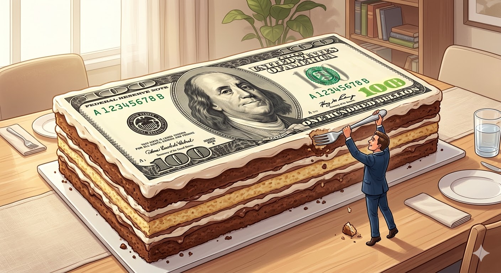
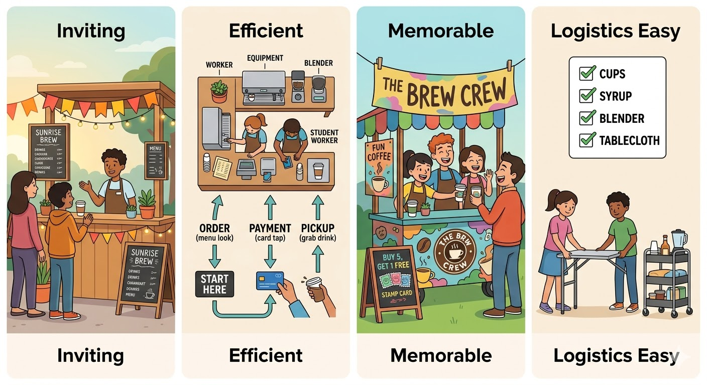

# Coffee Startup Club: Marketing

## Coffee Trivia

- The word "coffee" comes from the Arabic "qahwa," which originally referred to wine. It was later adopted into Turkish as "kahve" and then into European languages.
- Coffee is the second most traded commodity in the world after oil.
- The first coffeehouse in the world opened in Constantinople (now Istanbul) in the 15th century. It quickly became a hub for intellectual discussion and business deals.
- The "coffee break" tradition is believed to have originated in the early 20th century as a way to boost worker productivity and morale. In 1952, the Pan-American Coffee Bureau launched a campaign promoting the idea of a "coffee break" to increase coffee consumption among office workers.

## What is Marketing?

When we talk about marketing, we often think of it as "advertising", "social media" or "we pay some Youtubers for promotion like Nord VPN", or "marketing is the same as sales". It's actually much more. So, what is marketing?

> Marketing is the process of discovering what customers need — and then letting them know you can meet that need.

Take a moment to read this definition 3 times in your head until you can recite it. (pause) Then reflect on what it means. What does it mean to "discover what customers need"? How do you find out what customers want? And how do you let them know you can meet that need? First, circle the word "process". Marketing is a process. A process means that it's not just one thing, or one time, but a series of steps and activities that you do over and over again. Second, circle all the verbs in that definition. The first verb is "discover". This means that you have to actively seek out to understand your customers' needs. You can't just assume you know what they want. You have to do research, ask questions, and listen to their feedback. The second verb is "let them know". This means that you have to communicate effectively with your customers.

- **Marketing is not just Advertising:** Marketing is the entire process of understanding and reaching customers, while advertising is just one part of that process — the part where you create messages to promote your product. e.g., when you see a new trailer for a new movie, that's advertising. But the marketing has started long before that — from researching what kind of movies people want to see, to deciding on the movie's title and poster design, color themes, to choosing where to put the advertisements: on TV, on social media, on the box of McDonald's meals, or a preview in movie theaters.
- **Marketing is not just Sales:** Marketing starts before the customer walks in; sales happens once they're already there

## **No Marketing = No Success**

Let's review the statistics we saw in the first chapter about startup failures. 42% of startups fail because their product doesn't solve a real problem and 14% of startups fail because of poor marketing. This combines to 56% of startups failing because they don't have a good marketing strategy. This is more than half of all startups. So, I will say marketing is not just important, it's actually the most important thing for a startup.

We also saw that Americans alone spend over $100 billion on coffee every year. But does it mean that earning $5 out of that $100 billion cake is like a piece of cake? No. What the number doesn't tell you is this market is highly competitive.

It tells you "what happened", but it doesn't tell you "how to make it happen". Knowing how comes from talking to your customers, understanding their needs, and creating products and experiences that they will love.

So one of your first tasks this week as a marketer is to talk to your potential customers. They can be your teachers, friends, parents, or even yourself. Ask them about their coffee habits, what they like and dislike about coffee, what they look for in a coffee stand at a school event, and what would make them want to buy from you. This is called market research. It's the process of gathering information about your customers and it's your direct experience, we call first-hand research.

## We are not selling coffee

When you talk to your customers, keep in mind that they are not just buying a cup of coffee. They are buying:

- a moment of relaxation
- a chance to socialize with friends
- a quick energy boost
- something to hold in their hand (and show off, why not?)
- something that makes your parents proud of (club special, double win!)

Let's take Starbucks as an example.

Starbucks make a cup of coffee:

- a moment of relaxation by providing a cozy seating area with soft music and free Wi-Fi (pause for a moment and slowly move on)
- a chance to socialize with friends by creating a welcoming atmosphere and encouraging people to stay and chat
- a quick energy boost by offering a wide variety of caffeinated drinks and snacks
- something to hold in their hand (and show off) by designing visually appealing cups and offering seasonal drinks that people want to share on social media

Now imagine if Starbucks just focused on making good coffee, but didn't care about the experience, the atmosphere, the branding, and the social media presence. Would it be as successful as it is today? Probably not.

This is the power of marketing. It's not just ads, sales, or social media. It's product + experience.

> In one sentence:
>
> **We are not selling coffee but selling happiness.**

## Now the fun part: Build a Marketing Strategy

We've spoken a lot about what marketing is and how important it is, but how do you actually put into action? This is where a marketing strategy comes in.

> In one sentence:
>
> **A marketing strategy is a plan of action that helps you sell your products.**

It can be physical (e.g. coffee stand design, packaging) or digital (e.g. social media content, email newsletter, local newspaper). It can be a one-time campaign (e.g. back-to-school promotion) or an ongoing effort (e.g. maintaining an Instagram account).

### Stand Design

There are many ways to design a coffee stand, but here are some key principles to keep in mind:

- **Make it inviting:** Creeate a cozy and welcoming atmosphere. For example, you can use bright colors, a chalkboard menu, and some plants to create a cozy and welcoming atmosphere.
- **Make it efficient:** Design the layout of your stand to minimize wait times and make it easy for customers to order and pick up their drinks. For example, you can have a clear flow from ordering to payment to pickup, and make sure you have enough space for your equipment and supplies.
- **Make it memorable:** Create a unique and memorable experience that will make customers want to come back and tell their friends about it. For example, you can have a signature drink, a fun name for your stand, or a special promotion that encourages repeat business.
- **Make the logistics easy:** Design your stand in a way that makes it easy to set up and take down, especially if you plan to move it around to different events. For example, you can use a portable table or cart, and have a checklist of all the supplies you need to bring.

## Activity 1: Identify your customers (target market)

- Take a moment to think about who your customers will be. Are they adults or kids? What are their roles? Teachers? Students? Parents? What are their needs and pain points? What do they value when it comes to coffee? Write down your thoughts and share with the class.
- You don't have to serve everyone. Especially identify the people who are **not** your customers. These are the people who will never buy from you, no matter how good your coffee is. You have to accept that you can't serve everyone, and that's okay. What is not okay is to try to serve everyone and end up serving no one. For example, someone who is so picky about their coffee that they complain about the taste, the temperature, the size, the price. What do you do with this customer? Do you try to please them and end up making a bad experience for everyone else? Or do you politely explain that your coffee is not for everyone, and that's okay? This is the reality of marketing. You have to make choices about who you want to serve and who you don't want to serve.
  In fact, it's better to focus on a specific group of customers who are most likely to buy from you. This is called your target market. This will help you create marketing messages especially for the people who are not buying from you. For example, someone who never drinks coffee come to your stand, you can politely explain that your coffee is not for everyone, and that's okay.
