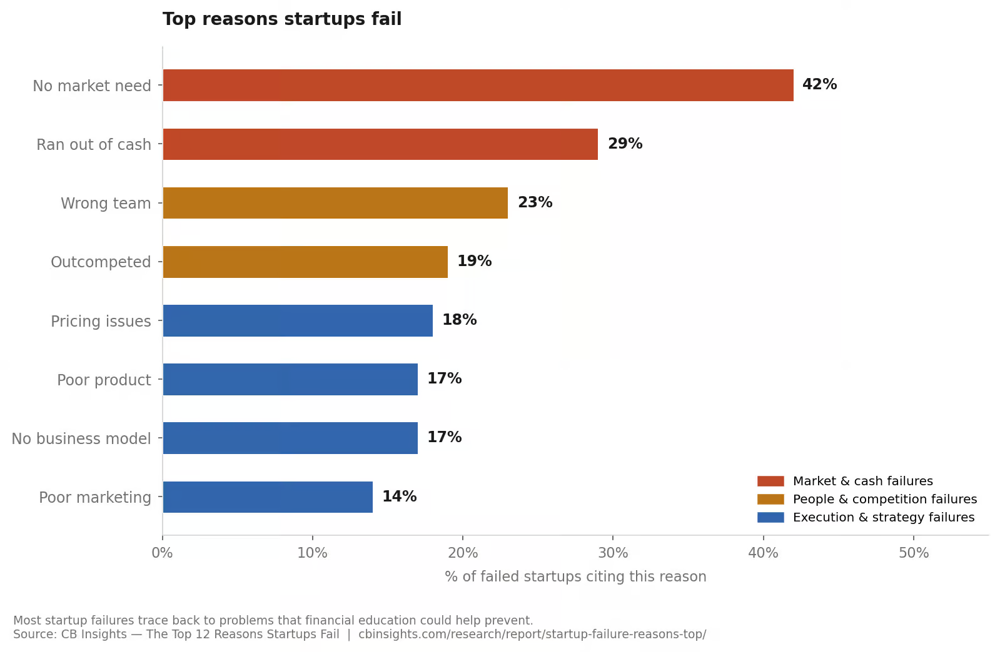
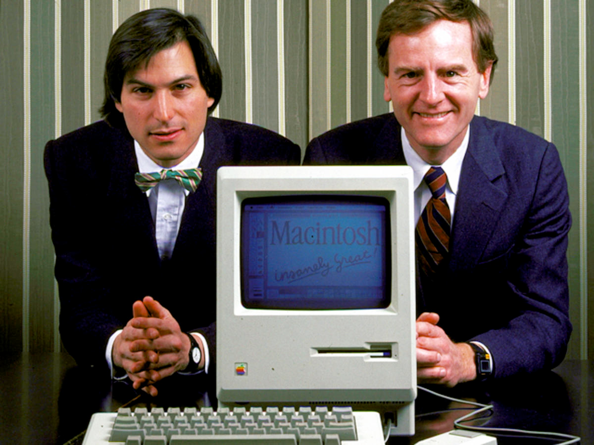
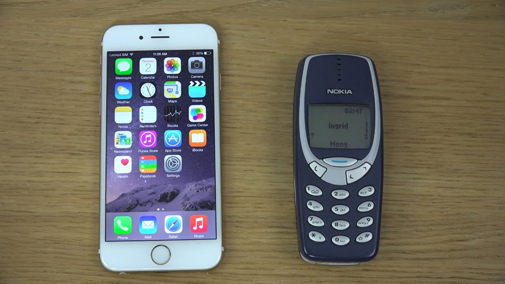
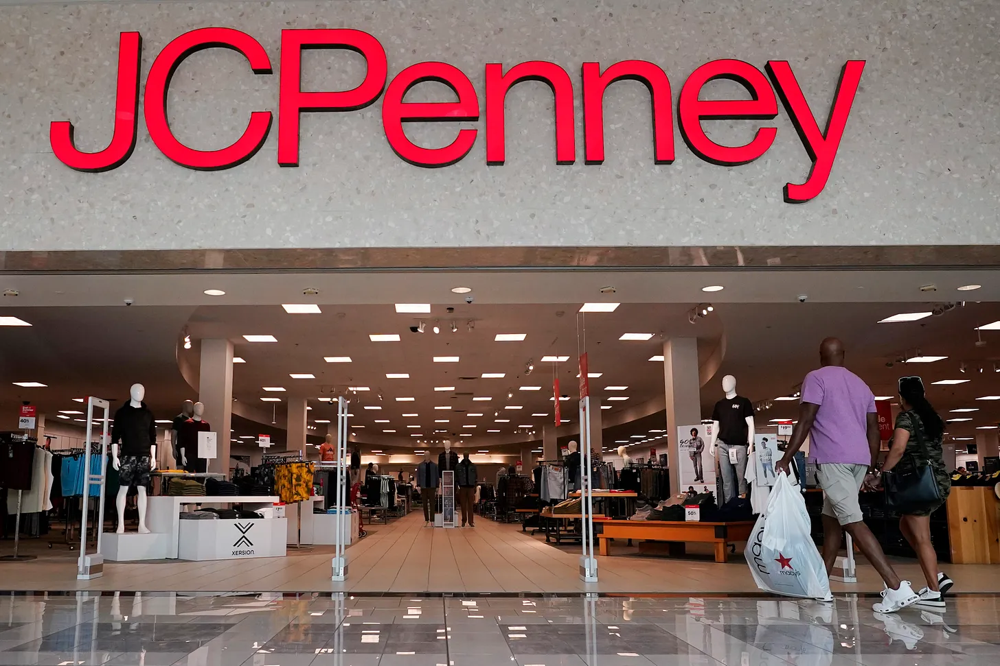
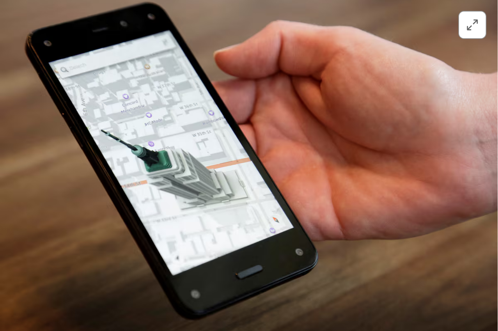
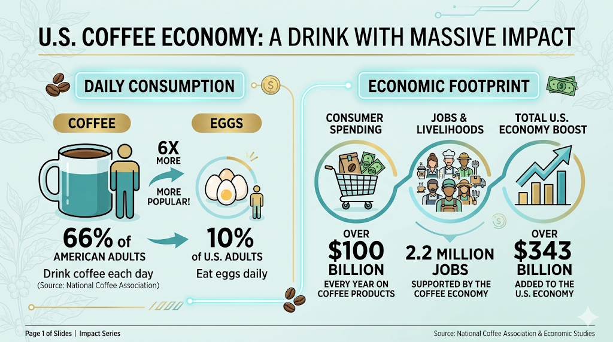
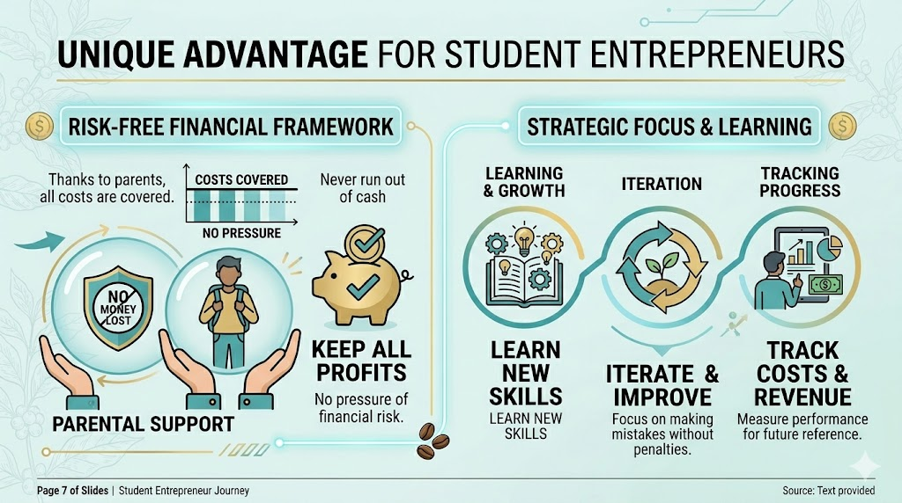
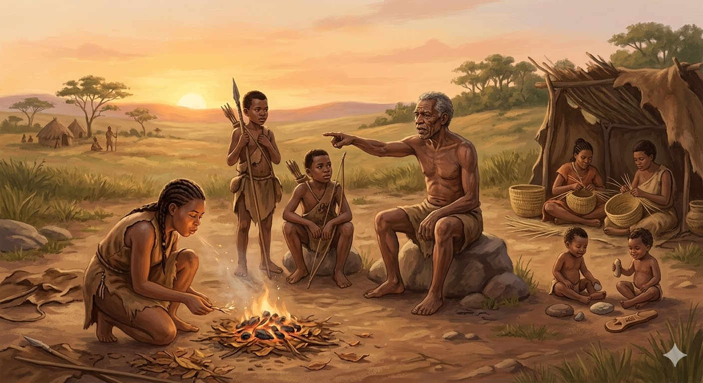

# Coffee Startup Club for Middle School Students - Day 1

Welcome to the Coffee Startup Club! In this program, you will get a hands-on experience in launching and running a real coffee business. You will be making coffee, selling coffee but more importantly, you are learning how to think like an entrepreneur, how to build a brand, how to manage costs, how to turn ideas into profits, and how to serve people.

Write down the word "**entrepreneur**" in your notebook. What does it mean to you? What do you think entrepreneurs do? (pause and let students reflect) We will explore these questions together as we build our coffee business.

By definition, an entrepreneur is someone who identifies a problem or opportunity and creates a solution that adds value to others. Entrepreneurs are problem solvers, creators, and leaders. They take risks, learn from failure, and keep improving until they succeed. In this club, I'm an entrepreneur and I'm teaching you to become one. You are doing your entrepreneurship by making and selling coffee. We are both entrepreneurs in this journey.

## Will we fail?

According to U.S. Bureau of Labor Statistics data, nearly half of all new businesses close within five years. So what actually kills startups? 

Research shows the top reasons startups fail:
- 42% of startups fail because there was _no market need_ — they built something nobody wanted. 

> Google Glass (2013) — high-tech glasses that let you check email and take photos in public. Cool idea, but people felt awkward wearing them and didn't want to be recorded. Nobody bought them.
- Another 29% simply _ran out of cash_. 
> MoviePass (2018) — offered unlimited movie tickets for $9.95/month. The problem: they paid full price for every ticket. With heavy users seeing 30+ movies a month, they were losing $40+ per customer per month. They burned through cash at a staggering rate and collapsed within a year. The math was broken from day one.

- 23% had the _wrong team_ — talented individuals who couldn't work together or lacked key skills. 

>Steve Jobs co-founded Apple, then personally recruited John Sculley away from Pepsi (not Coca-Cola) in 1983 with the famous line: "Do you want to sell sugar water for the rest of your life, or do you want to come with me and change the world?"
>Within two years, they clashed badly over product strategy and company direction. The board sided with Sculley and forced Steve Jobs out of his own company in 1985.
>Without Jobs, Apple spent 11 years making mediocre products and nearly went bankrupt. They brought Jobs back in 1997, and within a few years he launched the iMac, iPod, iPhone, and iPad — arguably the greatest product run in business history.

- 19% got _outcompeted_ — a better-funded or better-positioned rival won the market. 

>Nokia vs. iPhone (2007) — Nokia was the world's largest phone maker, selling nearly 40% of all phones on Earth. Then the iPhone launched. Nokia's CEO famously said they had "nothing to worry about." Within five years, Nokia's phone business was sold to Microsoft for almost nothing.

- 18% had _pricing issues_ (too high, too low, or no clear model).

>JCPenney (2012) — CEO Ron Johnson (the man who designed Apple Stores) eliminated all sales and coupons, moving to "everyday fair prices." Customers hated it. Sales dropped 25% in one year — $4 billion in lost revenue. He was fired after 17 months. People wanted to feel like they were getting a deal, even if the math was the same.

- 17% built a _poor product_, something that didn't meet customer expectations or solve their problem. 

> Amazon Fire Phone (2014) — Amazon's attempt at a smartphone. It had a gimmicky 3D display that nobody asked for, was priced like an iPhone, and ran a version of Android that couldn't access the Google Play store. It flopped within months.

- and another 17% had _no business model_ at all — they never figured out how to make money. 

!(No business model](images/no-business-model.png)
>Youtube (2005) — YouTube launched in 2005 and grew explosively, but it had no revenue model and no profit. It was just a free video-sharing site. Google acquired YouTube in October 2006 despite the fact that it had “shown no capability or interest in generating profit.” Over the next decade, YouTube added: Display ads, Pre‑roll video ads, Mobile ads, Content ID monetization, Subscription products (YouTube Red → Premium). It took 10 years before they developed an ad-based model that turned it into a profitable business.

- 14% failed at _marketing_ — a great product that nobody knew about.

>Pebble (2012) — The smartwatch that invented the smartwatch category, years before Apple Watch. It had a passionate fanbase but could never communicate its value to mainstream buyers. When Apple Watch launched with a massive marketing campaign, Pebble got crushed and sold for parts in 2016.

## We won't fail
Now let's go through these reasons and see how we can avoid them in our coffee business:

**Market Need** 

According to the National Coffee Association, 66% of American adults drink coffee each day (compare that to the 10% of U.S. adults who eat eggs daily). U.S. consumers spend more than $100 billion every year on coffee products, contributing to a coffee economy that supports 2.2 million jobs and adds over $343 billion to the U.S. economy. Why consumers spend more than $100b every year on coffee can add over $343 billion to the economy?
  > **The economic multiplier** Consumer spending on coffee doesn't just pay for the cup — it ripples through many layers of the economy:
  > Direct spending ($100B from consumers) triggers:
  > Supply chain activity — Retailers buy from distributors, who buy from roasters, who buy from importers, who buy from farmers. Each transaction adds value.
  > Employment income — Those 2.2 million jobs (baristas, truck drivers, equipment technicians, marketers, etc.) generate wages, which workers spend on other things, creating more economic activity.
  > Capital investment — Coffee shops buy espresso machines, build out spaces, pay rent. Roasters buy equipment. This spending flows into manufacturing, construction, and real estate.
  >
  > Support industries — Packaging, printing, logistics, software (POS systems), cleaning supplies — all these adjacent industries get revenue because coffee exists.
  >
  > **Simple analogy for middle schoolers:** You pay $5 for a latte. The coffee shop pays $1 to the roaster, $0.50 to the cup manufacturer, $1.50 in wages to the barista, $0.75 in rent. The barista uses their paycheck to buy groceries. The landlord uses rent to pay a plumber. Each dollar keeps moving.

Coffee is a product with a huge, established market. We are not trying to invent a new gadget or app that may or may not find users. We are selling something people already want and buy regularly. Our "market risk" is minimal — we just need to make sure our drinks taste good and we show up at the right events. We have a built-in customer base of classmates, teachers, and parents who will support us. That's a huge advantage compared to most startups.

**Ran out of cash? Never!**

The good news is that we don't have cash. Thanks to your parents, they are covering the costs and we keep all profits. This means we can focus on learning and iterating without the pressure of financial risk. We will track our costs and revenue, but we won't be losing money if we make mistakes. This is a huge advantage for us as student entrepreneurs.

**No Wrong Team** 

In adult startups, co-founders often break up over money, ownership, or who gets to be in charge. We don't have those problems — nobody owns shares here, nobody is risking their salary, and nobody gets fired. Our "team risk" is much simpler: showing up, doing your part, and supporting each other. That's something you already know how to do.

**Outcompeted** 

Adult startups compete for the same customers, the same market share, and sometimes the same survival. We're not in that fight. Our "competitors" are the vending machine down the hall or the café across the street — and we have something they don't: a personal connection. Your classmates and teachers know you. They want to see you succeed. That's a home-field advantage no funded startup can buy.

**Pricing issues**

Getting the price wrong can sink a real business — too high and customers leave, too low and you run out of money. We'll practice pricing math together: calculating exactly what each drink costs to make, then setting a price that covers costs and earns a profit. There's no mystery to it — it's just arithmetic. And if we get it wrong the first time, we adjust. No harm done.

**Poor product** 

As you can see, "Poor product" is the No. 6 reason startups fail. It's contrary to popular belief that companies bankrupt because their products are bad. Coffee drinkers are addicted. Unless you make a very bad cup, you will not have this risk. Also, they are very tolerant to young baristas. Our advantage: we get to practice, taste-test, and improve before we ever sell a single cup. Every session in the kitchen is a chance to make our drinks better. We are our own toughest critics — and that's a good thing.

**No business model** 

Many startups fail because they never figured out how they'd actually make money. We start with a simple, proven model: make a drink, sell it for more than it costs to make, keep the difference. It doesn't get more straightforward than that. As we grow, we can experiment — but the foundation is always the same.

**Poor marketing** 

A great product that nobody knows about doesn't sell. We'll learn how to spread the word — through social media, posters, word of mouth, and showing up at the right school events. The best part: young people do well in this field. That is your advantage. You know how to use Instagram and TikTok. You know how to make a fun video or a catchy post. You have a built-in audience of friends and classmates who want to support you. We will leverage those strengths to get the word out. You are the trend, not me.

## Failure is not an option

It was a phrase popularized by NASA during the Apollo missions, meaning that they had to succeed — there was no room for failure. Have you ever watched a show called "Blue Men" in Las Vegas? I had a friend who worked there. Yes, he was a blue man. He dreamed about being a blue man since he was your age. He practiced for years, auditioned, and finally got the role. He was on stage every night performing for thousands of people until one day, his manager called him into the office and said, "Sorry, we have to let you go." He was devastated. He had achieved his dream, but it was taken away from him. He felt like a failure. He ended up going back to school. It was a business school and he learned not only how to run a business but also realized that his strength was communication and storytelling. Suddenly, what he practiced as a blue man — engaging an audience, telling a story without words, connecting with people — became his superpower in the business world. He is now a successful entrepreneur. He told me "My parents always told me 'Failure is not an option.' Now I understand what they meant. Failure is not an option. It's a must."
In this club, we are learning by doing. Failure just means a lesson we haven't learned yet. Every burnt batch of coffee, every slow sales event, every idea that didn't work — that's not failure. It just means we need to make it better. A smart entrepreneur knows how to break down a big failure into smaller ones. We may not be able to handle big failures but we can handle small ones and turn them into opportunities.

## Let's take a break

(During the break, hand out the content of "What will we learn?" below)

## What will we learn?

Welcome back! Now that we've talked about what entrepreneurship is in theory, let's talk about what we are going to do in this club. I have printed it out for you. This is our roadmap for the next few weeks. Let's go through it together.

By the end of this program, you will be able to:

- **Entrepreneurship & Design Thinking**
  - Understand what makes a viable business idea
  - Identify customer problems and pain points
  - Develop a business plan from concept to execution
  - Make data-driven decisions based on sales and feedback

- **Product Development & Operations**
  - Master hands-on coffee preparation and quality control
  - Manage inventory, supplies, and logistics
  - Troubleshoot problems under pressure
  - Execute a real sales event end-to-end

- **Brand & Marketing**
  - Build a cohesive brand identity (name, visual style, voice)
  - Create content and manage social media presence (Instagram, TikTok)
  - Write copy that engages and converts
  - Use free design tools effectively

- **Financial Literacy**
  - Calculate cost per unit and set profitable pricing
  - Track revenue, expenses, and profit
  - Understand profit margins and reinvestment
  - Read and interpret basic business data

- **Teamwork & Communication**
  - Collaborate in assigned roles
  - Lead and support peers
  - Handle customer interactions professionally
  - Pitch ideas and present results to an audience

If you look at the syllabus, and you start to feel overwelmed, it means yo are a human. If not, you are a robot. Sorry, just kidding.

We are all human. Our brain is not designed to process a large amount of information at once. Thousands years ago, when our ancestors were living in caves, do you think they had to read a big syllabus with many words and go through all the chapters of a textbook called "How to hunt?" before they could go out and hunt for food? No. Every morning, they worry about one thing: survival. But the way they survived may not be what you think. Let me give you a story:

>It's early morning. The sun has just risen over the hills.
>
>A woman named Asha wakes up first. She is the fire keeper. She blows on the coals from last night, feeds them dry leaves, and gets the fire going. Without her, there is no warmth. No cooked food. Everyone else sleeps a little longer because they trust her to do this.
>
>An older man named Drum cannot run anymore — his knee was injured years ago. But his eyes are sharp and his memory is long. He knows which berries are safe, which clouds bring rain, which animal tracks mean danger is near. The young hunters come to him before they leave. He is the tribe's knowledge. Without him, the hunters would make dangerous mistakes.
>
>Three hunters — two teenagers and one young adult — head out at dawn. They move fast and quiet. Their only job today is to find food and bring it back. They are not thinking about fire, or berries, or how to cook. They trust that those things are handled.
>
>Back at camp, two women are weaving baskets and watching the young children. The baskets will carry the food the hunters bring back. The children they watch will one day be hunters, fire keepers, and weavers themselves.
>
>When the hunters return with meat, Asha's fire is ready. Drum tells them how to prepare it safely. The weavers bring the baskets. Everyone eats.
>
>Nobody did everything. Everybody did something. And because of that, everyone survived. In summary, they survived by serving because they can't survive alone.

So do me a favor. Scrample the paper and toss it. Do it now.

Good. In this club, we are like a small team within a large tribe. We don't serve meat like hunters. We serve coffee. We want to do our best to make the best coffee we can, to serve our customers well, and to support each other. We will learn by doing. We will learn by serving. 

The syllabus is just a roadmap. But it's not something you need to worry about. It's something I worry about - that's why I am here. Now write down the word "serve" in your notebook and reflect on what we just talked about and what it means to you. 

One of today's homework is making a coffee for your family. I have some instant coffee right here. Feel free to take one. I want you to find someone to serve. Make the best coffee with what you have and serve it to them with respect. The goal is to practice serving someone else. It could be your parents, your siblings. If you can't find anyone to serve at home, you can serve me if you want. I will be honored to be your first customer.